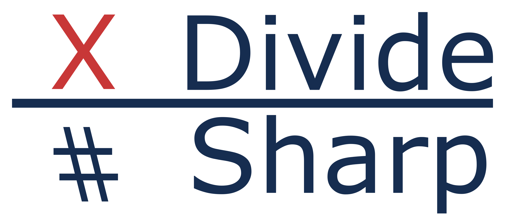

# DivideSharp - .NET Standard Integer Division Library
Like RyuJIT does before running, the DivideSharp optimizes an integer division by "mostly constant" values.

### Currently supported features
- Dividing two `uint` values quickly using `UInt32Divisor`

### Usage
#### Initialization
```csharp
var uInt32Divisor = new UInt32Divisor(19);
```
#### Ordinal Methods
- **Division**
```csharp
var quotient = uInt32Divisor.Divide(39); //2
```
- **Modulus(Modulo)**
```csharp
var remainder = uInt32Divisor.Modulo(39); //1
```
- **DivRem**
  - Unlike `Math.DivRem`, the `out` parameter is `quotient`, not `remainder`.
```csharp
var remainder = uInt32Divisor.DivRem(39, out var quotient);
//remainder: 1
//quotient: 2
```
- **Floor** Calculates the largest multiple of divisor less than or equal to the specified value.
```csharp
var rounded = uInt32Divisor.Floor(39); //38
```
- **FloorRem**
```csharp
var remainder = uInt32Divisor.Floor(39, out var rounded);
//remainder: 1
//rounded: 38
```

#### Operator Overloads
- **Division**
```csharp
var quotient = 38 / uInt32Divisor;  //2
```
- **Modulus(Modulo)**
```csharp
var remainder = 39 % uInt32Divisor; //1
```
